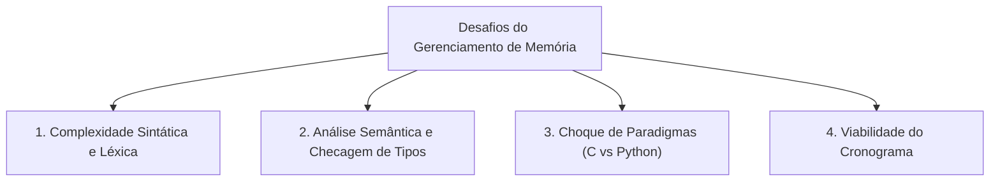

# Decisões de Projeto

Este documento registra as principais decisões de arquitetura e escopo tomadas pela equipe ao longo do desenvolvimento do compilador, servindo como registro histórico das motivações técnicas, alternativas consideradas e justificativas para os caminhos adotados.

---

## 1. Não Implementação de Gerenciamento de Memória e Ponteiros

### Status
**Aprovado e Adotado** (Sprint 1 / Sprint 2)

---

### Contexto
O projeto consiste na construção de um compilador cuja linguagem fonte é um subconjunto de **C** e cuja linguagem alvo final é **Python**. Durante a concepção da linguagem e o planejamento das sprints, a equipe avaliou a viabilidade de incluir suporte a ponteiros (`*ptr`, `&var`, `p->campo`), aritmética de ponteiros e gerenciamento dinâmico de memória (`malloc`, `calloc`, `free`).

Após análise técnica detalhada, a equipe deliberou por **não implementar** manipulação direta de ponteiros nem alocação dinâmica de memória no escopo do projeto, restringindo a linguagem a variáveis primitivas, vetores (`arrays`) com tamanho estático e registros heterogêneos (`struct`).

---

### Por que a manipulação de memória é tão difícil?

A manipulação de memória de baixo nível é um dos aspectos mais desafiadores da teoria e prática da construção de compiladores. A decisão de excluí-la decorreu de quatro fatores de alta complexidade técnica:

#### 1. Mismatch de Paradigmas de Memória (C → Python)
A principal dificuldade reside no abismo conceitual entre o modelo de memória de C e o de Python:

- **Modelo de C:** Memória linear, contígua e exposta diretamente como endereços numéricos em bytes. O programador controla o ciclo de vida de objetos no *stack* (pilha) e no *heap*, operando diretamente sobre ponteiros de memória.
- **Modelo de Python:** Memória totalmente abstraída e gerenciada por *Garbage Collector* (contagem de referências e detecção de ciclos). Não existem ponteiros físicos, aritmética de endereços nem liberação manual de blocos de memória na sintaxe do Python.

Traduzir operações como aritmética de ponteiros (`p + 2`, `*(ptr++)`) para Python exigiria que o nosso compilador implementasse uma **máquina virtual inteira de memória emulado** (como um array global de bytes em Python simulando uma RAM com offsets numéricos). Isso descaracterizaria o código Python gerado, tornando-o ininteligível, ineficiente e nada idiomático.

Além disso, primitivas como `free(ptr)` não possuem equivalente direto em Python, pois a linguagem não permite destruição forçada de memória em runtime.

#### 2. Complexidade na Análise Semântica e Sistema de Tipos
Implementar ponteiros multiplicaria a complexidade do analisador semântico de forma desproporcional:

- **Indireção Multinível:** O sistema de tipos precisaria suportar tipos recursivos com múltiplos níveis de indireção (`int*`, `int**`, `char***`), compatibilidade de ponteiros void (`void*`) e checagens estritas de coerção.
- **Aritmética de Ponteiros Dependente de Tamanho:** A expressão `ptr + 1` não soma 1 byte, mas sim `sizeof(*ptr)`. Isso exigiria que a tabela de símbolos e o verificador de tipos calculassem layouts de memória precisos de tipos primitivos e estruturas compostas, considerando alinhamento de memória (*padding*).
- **Semântica de *l-values* e *r-values*:** Distinguir atribuições de ponteiro (`p = q;`), atribuições de valor apontado (`*p = *q;`) e obtenção de endereço (`p = &x;`), prevenindo estados ilegais como criar ponteiros para expressões literais temporárias (`&10;`).

#### 3. Ambiguidade e Sobrecarga Sintática
A inclusão de ponteiros introduz ambiguidades que complicam a gramática do Bison (`parser.y`):

- O símbolo `*` atua como operador binário de multiplicação (`a * b`), operador unário de desreferenciação (`*p`) e declarador de tipo (`int *p;`). Em declarações complexas ou expressões com cast, resolver esses conflitos na gramática BNF/EBNF exige regras auxiliares extensas para evitar conflitos de *shift/reduce*.
- O operador `&` colide entre o operador unário de endereço (*address-of*) e o operador bitwise binário.

#### 4. Segurança e Risco ao Cronograma
Lidar com ponteiros sem um sistema avançado de análise de fluxo estático abre espaço para erros críticos em tempo de execução:
- Desreferenciação de ponteiro nulo (*null pointer dereference*).
- Ponteiros soltos (*dangling pointers*) decorrentes de descarte prematuro com `free`.
- Vazamentos de memória (*memory leaks*).

Garantir diagnósticos úteis em tempo de compilação para esses cenários consumiria semanas de desenvolvimento, comprometendo a entrega das fases essenciais da disciplina (Análise Léxica, Análise Sintática, Análise Semântica da AST e Geração de Código).

---

### Solução e Alternativas Adotadas

Para manter o compilador robusto, seguro e com escopo viável no semestre letivo, optamos pelo seguinte conjunto de restrições:

| Recurso | Decisão | Alternativa Implementada |
|---|---|---|
| **Alocação Dinâmica** (`malloc`/`free`) | Não implementado | Alocação automática/estática na pilha (*stack*) |
| **Ponteiros** (`*ptr`, `&var`) | Não implementado | Variáveis escalares acessadas diretamente pelo identificador |
| **Acesso Indireto** (`p->campo`) | Não implementado | Acesso direto a membros via operador ponto (`struct.campo`) |
| **Estruturas de Dados** | Suportadas | `struct` e vetores (`arrays`) com tamanhos definidos |
| **Passagem de Parâmetros** | Simplificada | Passagem por valor para tipos primitivos e cópia de estruturas |

### Conclusão e Benefícios
Essa decisão garantiu que a equipe pudesse:
1. Construir uma **especificação léxica e sintática rigorosa e sem ambiguidades**, com 100% de testes automatizados aprovados;
2. Focar na correta modelagem da **Árvore Sintática Abstrata (AST)** e da **Tabela de Símbolos**;
3. Assegurar que a futura geração de código para **Python** seja limpa, idiomática e mapeie naturalmente as estruturas e funções da linguagem fonte.
