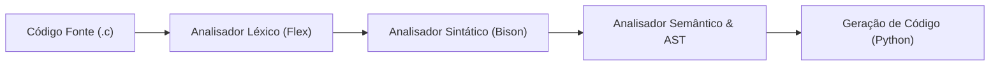

# Compiladores UnB

Bem-vindo à documentação oficial do projeto prático desenvolvido para a disciplina de **Compiladores** da **Universidade de Brasília (UnB)**.

---

## Visão Geral do Projeto

O objetivo deste projeto é o desenvolvimento de um compilador/transpilador com *frontend* construído utilizando **C**, **Flex** e **Bison**. O compilador tem como meta processar uma linguagem fonte (um subconjunto expressivo e simplificado de **C**) e realizar a análise e geração de código alvo para **Python**.

### Recursos Suportados pela Linguagem
- **Tipos de dados primitivos:** `int`, `float`, `char`, `bool` e `void`.
- **Estruturas de controle de fluxo:** condicionais (`if`, `else`, `switch`, `case`, `default`) e laços (`while`, `for`, `break`, `continue`).
- **Funções e recursão:** declaração e definição de funções com múltiplos parâmetros, retorno de valores e chamadas recursivas.
- **Tipos estruturados e agregados:** estruturas (`struct`) e vetores (`arrays`) com indexação e acesso a membros.
- **Operadores:** aritméticos, relacionais, lógicos, de incremento/decremento e atribuição composta.

> **Decisão de Arquitetura:** Para garantir um escopo viável e foco na robustez da pipeline e na tradução para Python, a linguagem **não** implementa manipulação direta de memória e ponteiros (`malloc`, `free`, `*ptr`, `&var`), restringindo variáveis e estruturas a escopos estáticos e locais.

---

## Estrutura da Pipeline

1. **Analisador Léxico (Scanner):** Responsável pela conversão do fluxo de caracteres em tokens padronizados, descarte de comentários/espaços e reporte detalhado de erros léxicos com linha e coluna.
2. **Analisador Sintático (Parser):** Aplica a Gramática Livre de Contexto (GLC) sobre os tokens, validando a estrutura sintática das declarações, comandos e expressões.
3. **Analisador Semântico:** Construção da Árvore Sintática Abstrata (AST), tabela de símbolos e checagem estática de tipos e escopos.
4. **Geração de Código:** Tradução da representação intermediária/AST para código executável em **Python**.

---

## Guias e Especificações

Navegue pela documentação técnica através das seções:

- [**Especificação Léxica (Tokens e Expressões Regulares)**](tokens.md): Tabela de palavras reservadas, operadores, literais e validação das expressões regulares do Flex.
- [**Gramática Livre de Contexto (GLC)**](gramatica.md): Especificação formal em EBNF de todas as produções sintáticas implementadas no Bison.
